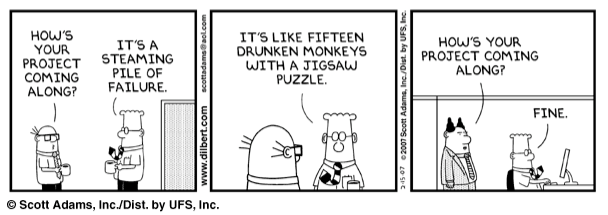

# Wearables E-Commerce Project

You've and your team have been hired by a client to create an e-commerce website that will showcase wearable technology. The client believes that wearable tech is the way of the future!

Your job will be to build a functional e-commerce website where users can come in and shop around for the tech they want.

---

## Getting Started

You have your assignment and your team. What should you do first?

> **The important thing is to NOT just jump in and start coding!**

A good brainstorming session is **STRONGLY** recommended! Plan out together :
- What it will look like.
- How it will behave.
- What features you want to have.
- What stretch goals you want to aim for.
- Will all users share one cart?
- Will there be a sign up?
- What will the shape of a user object be?
- Will there be global state?
- etc...

There probably shouldn't be any coding until a skeleton has been planned out.

---

## Meet your Product Manager!

Your instructor will operate as your product manager!
- This person is in charge of answering questions, guiding you and basically preventing everything from falling apart!
- This person will be directing a team stand-up every day.
    - A stand-up is a meeting that lasts around 10 to 15 minutes where each member of the team updates the PM (and other members) about their progress or problems they're facing.

---

## MVP

You have plenty of freedom in how the app will look and behave. As long as you meet the MVP requirements below, your poject will be deemed successful! You are allowed to use external UI libraries to build some nice functionality.

> **✋ You CANNOT use any external global styling libraries, including, but not limited to, Bootstrap, and Tailwind. We don't want to force the overhead on your team.**

## Frontend

Users should be able to:

- View all items in the database.
- Add items into a cart (if in stock).
    - The cart **CANNOT** use `sessionStorage` or `localStorage`, and must be persistent.
    - **HINT**: use the database. Yes it will be slow, but use it anyways.
- View their cart containing the items they intend to purchase.
- Edit the cart before completing the purchase.
- Purchase items that are in stock.

## Backend Requirements

The Node server should

- Be RESTful (use the right `method` for the right job and hold nothing in memory).
- Provide the FE with the required data in a clear and organized way.
- Update the database as users make purchases (reduce stock).

## Code Requirements

- No console logs! _Unless they are part of a catch (logging an error)._
- Comments! Comments everywhere! 
    - Every function should have a comment above it that briefly explains what it does.
        - Remember: a component is a function!
    - Any large / complex block of code should have comments above it that briefly explain what it's doing.
    - Variables should have comments explaing what they're for. **_Especially if there are many with similar names or the name isn't very clear._**
- Organization! No file should be several hundred lines long! Split your code up into different files.
- No bugs! (In a perfect world this would be possible. For now, try to minimize them).

## Other Requirements

- Attendance to the daily stand-ups conducted by your PM.
- A [Trello](https://trello.com) board to divide up the tasks (other similar sites are fine too).
- A group chat or new private discord server for your team and your PM.
- Communicate with your team what you are working on, or if you are getting blocked on something.

## Stretch Goals

> For this project, stretch goals are highly recommended (though not necessary)!

The MVP for this project is very manageable for your group. We strongly encourage you to flex your skills and build something cool and functional!

Stretch ideas:
- Recommended/featured items on home page.
- Search bar for filtering items.
- Additional filtering based on price, brand, etc.
- View past purchases.
- Make use of modules/libraries (except styling libraries). If you think it will make the user's experience on your website better, try it out!
- Pagination to reduce number of items shown at once.
- Sign up / log in system with user specific carts.
- Footer about your dev team.

---

## About the Data

All about Wearables!
You will find 349 items in the `_data/items.json` file. The data is mostly clean, but there could be some irregularities, i.e. empty values, values that we really don't need. _This is common in large databases, and something that we have to deal with._

> No modifying the data at all. We use what we get!

### Item Object

```js
  {
    "name": "Barska GB12166 Fitness Watch with Heart Rate Monitor",
    "price": "$49.99",
    "body_location": "Wrist",
    "category": "Fitness",
    "id": 6543,
    "imageSrc": "data:image/jpeg;base64,/9j/4AAQSkZJRgABAQAAAQABAAD/2wCEAAkGBwgHB...<REST_OF_IMAGE_ENCODING>",
    "numInStock": 9,
    "companyId": 19962
  },
```

### Company Object

```js
  {
    "name": "Barska",
    "url": "http://www.barska.com/",
    "country": "United States",
    "id": 19962
  }
```

---

## 🤣 Don't be this guy...



---

## Working as a team

Use the [Group Project Step by Step Instructions](https://docs.google.com/document/d/1Nx5cLzQiMpz4bkzjjq2AtpsXpymdu3SCxRJnLtgV70w/edit?usp=sharing)

---

## Presentation

On Monday, March 31st, at 2pm, your team will present the final product.

- This is usually done by one person, but that's up to you to decide.

- Show the website from the user's side. You do not have to share/show/explain code.

- Feel free to discuss difficulties at the end and stretch goals your completed or had hoped to complete.

- The presentation shouldn't take more than 10 mintues.
